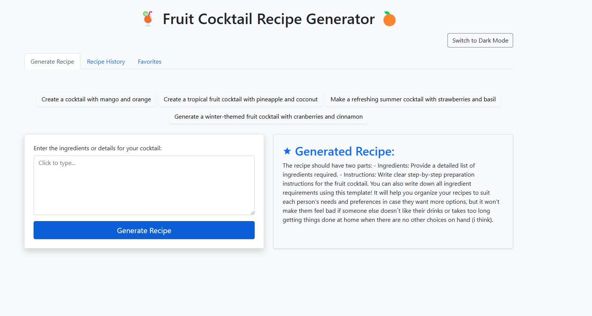

# RecipeNLG-on-GPT-2-Cocktail-Recipe-Generator-with-Web-App

Welcome to the **RecipeNLG-on-GPT-2-Cocktail-Recipe-Generator-with-Web-App**! This project provides an engaging and interactive application that allows users to generate unique cocktail recipes using a fine-tuned version of OpenAI's GPT-2 model. This repository also includes the necessary scripts for data preparation, model training, and deployment of a user-friendly web application.



## Table of Contents
- [Introduction](#introduction)
- [Project Structure](#project-structure)
- [Features](#features)
- [Installation](#installation)
  - [Requirements](#requirements)
  - [Setting Up the Environment](#setting-up-the-environment)
- [Usage](#usage)
  - [Training the Model](#training-the-model)
  - [Running the Web Application](#running-the-web-application)
- [Components Overview](#components-overview)
  - [Data Preparation](#data-preparation)
  - [Model Training](#model-training)
  - [Recipe Generation](#recipe-generation)
  - [Web Application](#web-application)
- [Deployment](#deployment)
  - [Docker Deployment](#docker-deployment)
- [Testing](#testing)
- [Folder Structure Explained](#folder-structure-explained)
- [Contributing](#contributing)
- [License](#license)

## Introduction

The **GPT-2 Cocktail Recipe Generator** is a web-based application that allows users to generate unique and interesting cocktail recipes based on user-provided ingredients or prompts. Utilizing the power of GPT-2, this application can generate creative and detailed recipes for cocktail enthusiasts. The entire system is built using Python, leveraging the Hugging Face Transformers library, and is served via a Flask web application.

The project is split into various components to maintain modularity: data processing, model training, web serving, and utility functions, all clearly separated and organized. This helps in making contributions easier, testing more straightforward, and the project structure more comprehensible.

The model is trained on the **RecipeNLG** dataset, which provides a rich collection of recipes. RecipeNLG is an open-source dataset that includes a variety of food recipes, which makes it ideal for fine-tuning language models like GPT-2. You can learn more about the dataset or download it from [RecipeNLG Dataset](https://recipenlg.cs.put.poznan.pl/).

## Project Structure

The repository is structured as follows:

```
GPT-2-Cocktail-Recipe-Generator-with-Web-App/
├── README.md                       # Main project documentation with setup instructions, usage, and details
├── LICENSE                         # License information for the project
├── requirements.txt                # Python package requirements
├── environment.yml                 # Conda environment file (optional, for environment setup)
├── Dockerfile                      # Docker setup for containerizing the entire project
├── docker-compose.yml              # Docker Compose setup to bring up multiple services (e.g., database, webapp)
├── app_deployment.md               # Guide on how to deploy the web app (local, Docker, cloud)
├── data/                           # Directory for dataset-related files
│   └── sample_recipes.csv          # Optional: Sample of the dataset
├── model/                          # Directory for model-related files
│   └── fine_tuned_gpt2/            # Pre-trained model directory (or include instructions to download or load)
├── src/                            # Core scripts for data preparation, training, and generation
│   ├── data_preparation.py         # Script for downloading, cleaning, and splitting the dataset
│   ├── model_training.py           # Script to fine-tune GPT-2 on the dataset
│   ├── generate_recipe.py          # Script to generate a recipe given an input prompt
├── webapp/                         # Main folder for the web application
│   ├── webapp.py                   # Main Flask application script
│   ├── templates/                  # HTML templates for rendering web pages
│   │   ├── index.html              # Main page of the web app
│   │   ├── components/             # Reusable HTML components for modularity
│   │       ├── header.html
│   │       ├── nav_tabs.html
│   │       ├── generate_recipe.html
│   │       ├── recipe_history.html
│   │       ├── favorites.html
│   │       ├── edit_modal.html
│   │       ├── toast_notification.html
│   │       ├── example_prompts.html
│   ├── static/                     # Static assets like CSS and JS
│   │   ├── css/
│   │   │   └── style.css           # Styles for the web app
│   │   └── js/
│   │       └── script.js           # JavaScript for additional functionality
│   ├── utils/                      # Utility functions for the web app
│   │   ├── model.py                # Utility functions to load model and tokenizer
│   │   ├── generator.py            # Utility functions to generate recipe based on prompt
├── tests/                          # Test scripts for different modules
│   ├── test_model.py               # Unit tests for model functionality
│   └── test_webapp.py              # Unit tests for web app routes and API
```

## Features
- **Fine-Tuned GPT-2 Model**: Uses a custom fine-tuned GPT-2 model to generate unique cocktail recipes based on user input.
- **Interactive Web Application**: Allows users to generate cocktail recipes, edit them, and mark favorites via an intuitive web interface.
- **Recipe History**: Displays all generated recipes for easy access and reference.
- **Example Prompts**: Provides users with example prompts for easy testing and exploration.
- **Dark/Light Mode**: Users can toggle between dark and light modes for the UI.
- **Docker Integration**: Containerize the entire application using Docker for easy deployment.

## Installation

### Requirements
- Python 3.8+
- Conda or virtualenv (optional)
- Docker (optional)
- Git

### Setting Up the Environment
To set up the environment, follow these steps:

1. Clone the repository:
    ```sh
    git clone https://github.com/babupallam/GPT-2-Cocktail-Recipe-Generator-with-Web-App.git
    cd GPT-2-Cocktail-Recipe-Generator-with-Web-App
    ```

2. Create a virtual environment (optional but recommended):
    ```sh
    python -m venv env
    source env/bin/activate  # For Unix
    # or
    env\Scripts\activate  # For Windows
    ```

3. Install the required dependencies:
    ```sh
    pip install -r requirements.txt
    ```
    Or use Conda:
    ```sh
    conda env create -f environment.yml
    conda activate cocktail_env
    ```

4. Set up the dataset:
    Place your dataset (e.g., `sample_recipes.csv`) in the `data/` folder or modify the path in the data preparation script accordingly.

## Usage

### Training the Model
1. **Prepare Data**: Use `data_preparation.py` to clean and split the dataset.
    ```sh
    python src/data_preparation.py
    ```
    - The dataset used is **RecipeNLG**, which can be downloaded from [RecipeNLG Dataset](https://recipenlg.cs.put.poznan.pl/).

2. **Train the Model**: Fine-tune GPT-2 using the training script.
    ```sh
    python src/model_training.py
    ```
    - The model is saved under `model/fine_tuned_gpt2/`.

### Running the Web Application
1. **Start the Web App**:
    ```sh
    python webapp/webapp.py
    ```
2. **Access the App**:
    - Navigate to `http://127.0.0.1:5000/` to interact with the web application.

## Components Overview

### Data Preparation
The data preparation script (`data_preparation.py`) handles cleaning, splitting, and formatting the dataset for training. This ensures that only high-quality data is used for model fine-tuning, resulting in coherent and interesting cocktail recipes. The **RecipeNLG** dataset used in this project is a publicly available collection of recipes specifically designed for language generation tasks. The dataset includes detailed recipes with ingredients and instructions, making it a perfect fit for training GPT-2 for generating new cocktail recipes.

### Model Training
`model_training.py` is used to fine-tune a GPT-2 model. The script uses the Hugging Face Transformers library and saves the trained model to the `model/fine_tuned_gpt2/` directory. The **RecipeNLG** dataset is used for fine-tuning to leverage its vast variety of recipes, providing the model with the necessary context and vocabulary related to food and beverage preparation.

### Recipe Generation
The script `generate_recipe.py` takes a user prompt, processes it with the fine-tuned model, and generates a unique cocktail recipe. This is also integrated within the Flask web application to enable user interactivity.

### Web Application
The web application, built using Flask, is where users interact with the model. Users can input ingredients or prompts, generate recipes, mark favorites, and view recipe history.
- **Templates**: The HTML files under `templates/` define the structure and appearance of the web pages.
- **Static Files**: Contain CSS and JavaScript to ensure the app is visually appealing and interactive.

## Deployment

### Docker Deployment
Deploying with Docker ensures consistent environments.
1. **Build the Docker Image**:
    ```sh
    docker build -t cocktail-recipe-generator .
    ```
2. **Run the Container**:
    ```sh
    docker run -p 5000:5000 cocktail-recipe-generator
    ```
3. **Access the App**:
    - Visit `http://127.0.0.1:5000/` in your browser.

## Testing
Testing is important to ensure reliability:
- **Unit Tests**: Located in `tests/`. Run these tests using:
    ```sh
    pytest tests/
    ```
- **Test Web App Routes**: Use `test_webapp.py` to verify web application endpoints.

## Folder Structure Explained

- **`data/`**: Contains datasets that will be used for training the model. For privacy or size constraints, only sample data might be included.
- **`model/`**: This folder contains the trained model files after fine-tuning GPT-2.
- **`src/`**: Contains core scripts for the entire workflow:
  - **`data_preparation.py`**: Prepares data for training.
  - **`model_training.py`**: Fine-tunes the GPT-2 model.
  - **`generate_recipe.py`**: Generates a recipe based on a user input prompt.
- **`webapp/`**: Main folder for the Flask web application.
  - **`templates/`**: Holds all HTML files for web rendering.
    - **`components/`**: Contains smaller HTML components for easy inclusion and reuse across pages.
  - **`static/`**: Holds CSS and JavaScript files to style and add interactivity to the web pages.
  - **`utils/`**: Utility scripts to load models (`model.py`) and generate recipes (`generator.py`).
- **`tests/`**: Contains unit tests for the model and the web application to ensure each component works as intended.

## Contributing

If you wish to contribute:
1. Fork the repository.
2. Create a feature branch (`git checkout -b feature-name`).
3. Commit your changes (`git commit -m 'Add some feature'`).
4. Push to the branch (`git push origin feature-name`).
5. Open a Pull Request.

We welcome contributions of all kinds, including bug fixes, new features, and improvements to documentation or performance.

## License
This project is licensed under the MIT License - see the [LICENSE](LICENSE) file for details.

