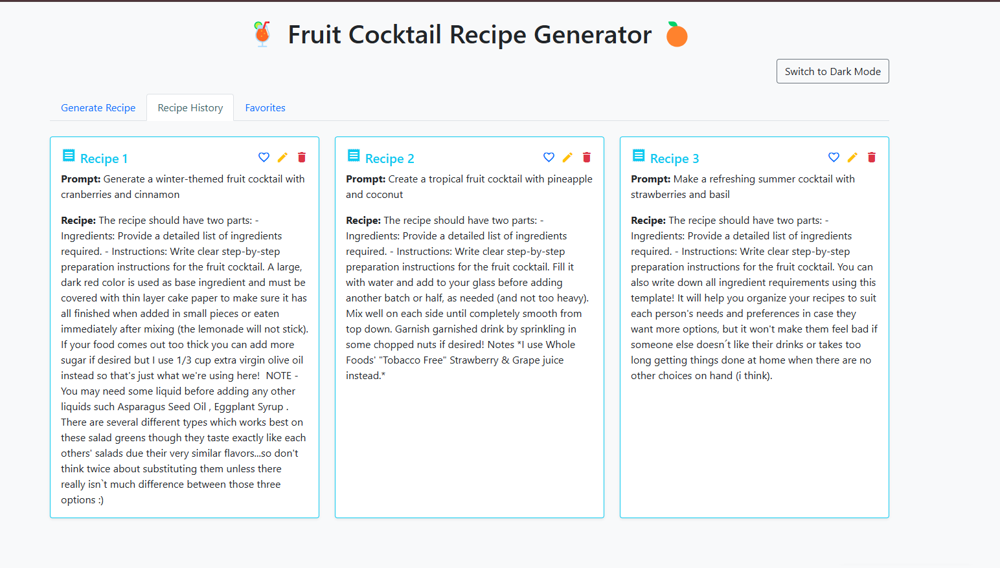

# Fruit Cocktail Recipe Generator




## Overview

The **Fruit Cocktail Recipe Generator** is a web-based application designed to help users create unique and delicious fruit cocktail recipes with ease. Using an intuitive user interface, users can enter their desired ingredients or choose from example prompts to generate a custom fruit cocktail recipe. The application also includes features like recipe history and favorites, all built using a modular approach for easier maintainability.

This project utilizes **Flask** as the backend framework and **Bootstrap** for front-end styling, with extensive use of **Material Design** elements to provide a clean and interactive experience. A dark and light mode toggle ensures a seamless experience for all users regardless of their viewing preferences. The project also features modular HTML components, ensuring that the code is organized and easy to maintain.

## Table of Contents

1. [Features](#features)
2. [Screenshots](#screenshots)
3. [Technologies Used](#technologies-used)
4. [Project Structure](#project-structure)
5. [Installation and Setup](#installation-and-setup)
6. [Usage](#usage)
7. [How to Contribute](#how-to-contribute)
8. [Future Enhancements](#future-enhancements)

## Features

### 1. Recipe Generation
The main feature of the **Fruit Cocktail Recipe Generator** is to provide users with fruit cocktail recipes. Users can either type in their desired ingredients or select from a list of provided example prompts to generate a custom cocktail recipe.

- **Example Prompts**: Users can select one of the example prompts for faster recipe generation.
- **Custom Input**: Users can enter specific ingredients or instructions to receive tailored recipes.

### 2. Recipe History
Every generated recipe is stored in the **Recipe History** tab, allowing users to revisit previously generated recipes.

- Users can edit, favorite, or delete each recipe from the history.
- The history section also uses Material Design cards to display the information clearly.

### 3. Favorites
The **Favorites** tab allows users to save their favorite recipes for future reference.

- Recipes can be added to favorites from the recipe history.
- Users can remove recipes from the favorites tab easily.

### 4. Dark and Light Theme
The application includes a theme toggle button that allows users to switch between **dark** and **light** modes.

- The **light mode** provides a bright, clean interface that is ideal for daylight conditions.
- The **dark mode** is suitable for low-light environments, reducing eye strain and providing a sleek, modern look.

### 5. Modular Design
The project uses a modular approach to improve maintainability and readability:
- HTML components are split into smaller reusable templates.
- CSS and JavaScript files are organized separately to facilitate ease of use.

## Screenshots

### Main UI


In the light mode, the application features a bright, clean interface with prominent colors for buttons and icons. The example prompts are displayed at the top, followed by an input form to enter custom prompts.

### History Tab 


## Technologies Used

The **Fruit Cocktail Recipe Generator** is built using the following technologies:

- **Python**: The backend logic for the project is implemented using Python, utilizing the **Flask** framework to manage web requests and responses.
- **Flask**: The web framework is used to create REST APIs and serve web pages to users.
- **HTML/CSS**: Used for creating the front-end interface, with **Bootstrap** for easy and responsive UI design.
- **JavaScript**: Used for various interactive features like toggling between themes and showing/hiding elements.
- **Material Design**: Material Design principles are used to style components, giving a modern and consistent look to the entire application.
- **Jinja2**: Template engine used for rendering HTML pages.

## Project Structure

The project is organized in a modular manner to make it easier to maintain and expand. Below is a brief overview of the directory structure:

```
webapp/
├── templates/
│   ├── base.html                # Base HTML template for common structure
│   ├── index.html               # Main HTML page for rendering content
│   ├── components/              # Directory for modular components
│   │   ├── header.html          # Header for the website
│   │   ├── nav_tabs.html        # Navigation tabs for the site
│   │   ├── generate_recipe.html # Recipe generation form and prompts
│   │   ├── recipe_history.html  # Recipe history content
│   │   ├── favorites.html       # Favorites section
│   │   ├── edit_modal.html      # Modal for editing recipes
│   │   ├── toast_notification.html # Toast notifications for success messages
│   │   ├── example_prompts.html # Example prompts to generate recipes
├── static/
│   ├── css/
│   │   └── style.css            # CSS styles for the app
│   ├── js/
│   │   └── script.js            # JavaScript for client-side interactivity
├── app.py                       # Main application entry point
```

## Installation and Setup

To set up this project locally, please follow these steps:

### Prerequisites

- Python 3.x installed on your system
- Git for version control
- (Optional) Virtual environment tool such as `virtualenv`

### Steps

1. **Clone the Repository**

   ```bash
   git clone https://github.com/yourusername/fruit-cocktail-generator.git
   cd fruit-cocktail-generator
   ```

2. **Create and Activate a Virtual Environment**

   ```bash
   python -m venv venv
   source venv/bin/activate # On Windows use `venv\Scripts\activate`
   ```

3. **Install the Requirements**

   Install all dependencies using the `requirements.txt` file:

   ```bash
   pip install -r requirements.txt
   ```

4. **Run the Application**

   Start the Flask server:

   ```bash
   flask run
   ```

   The application will start locally, and you can view it in your browser at `http://127.0.0.1:5000/`.

## Usage

1. **Generate a Recipe**
   - Navigate to the **Generate Recipe** tab.
   - Use the example prompt buttons or type in the ingredients manually.
   - Click **Generate Recipe** to see a custom recipe.

2. **Recipe History and Favorites**
   - Each generated recipe is saved in the **Recipe History** tab.
   - From the history, you can add recipes to the **Favorites** tab.
   - You can also edit or delete recipes as required.

3. **Theme Switching**
   - Use the **"Switch to Dark Mode"** button to toggle between light and dark themes.

## How to Contribute

We welcome contributions to make this project better! Here are some ways you can help:

1. **Fork the Repository**: Click on the **Fork** button at the top-right corner of the repository page.
2. **Create a Branch**: Create a new branch for your changes.
   ```bash
   git checkout -b feature-name
   ```
3. **Make Your Changes**: Edit and improve the code.
4. **Commit Your Changes**: Commit your changes with a descriptive commit message.
   ```bash
   git commit -m "Add new feature"
   ```
5. **Push to Your Branch**: Push the changes to your forked repository.
   ```bash
   git push origin feature-name
   ```
6. **Submit a Pull Request**: Open a pull request from your repository's branch to the main repository.

## Future Enhancements

### 1. User Authentication
- Implement a user authentication system to allow users to save their recipes and history across different devices.

### 2. Interactive Recipe Builder
- Create a more interactive way to build recipes, where users can choose ingredients visually and get real-time suggestions.

### 3. Recipe Sharing Feature
- Allow users to share their generated recipes on social media platforms directly from the application.

### 4. Improved Recipe Database
- Integrate a database of recipes to suggest popular options based on user preferences and trending ingredients.

### 5. Mobile-First Design
- Improve the user interface for better performance and experience on mobile devices.

## Acknowledgments
- **Bootstrap** for providing a comprehensive CSS framework to build responsive interfaces.
- **Material Design** guidelines for influencing the design language of the application.
- The **Flask** community for creating such a versatile and easy-to-use framework for web applications.

Thank you for using **Fruit Cocktail Recipe Generator**! We hope this project helps you discover your next favorite cocktail. Feel free to explore, contribute, and share your thoughts with us.

